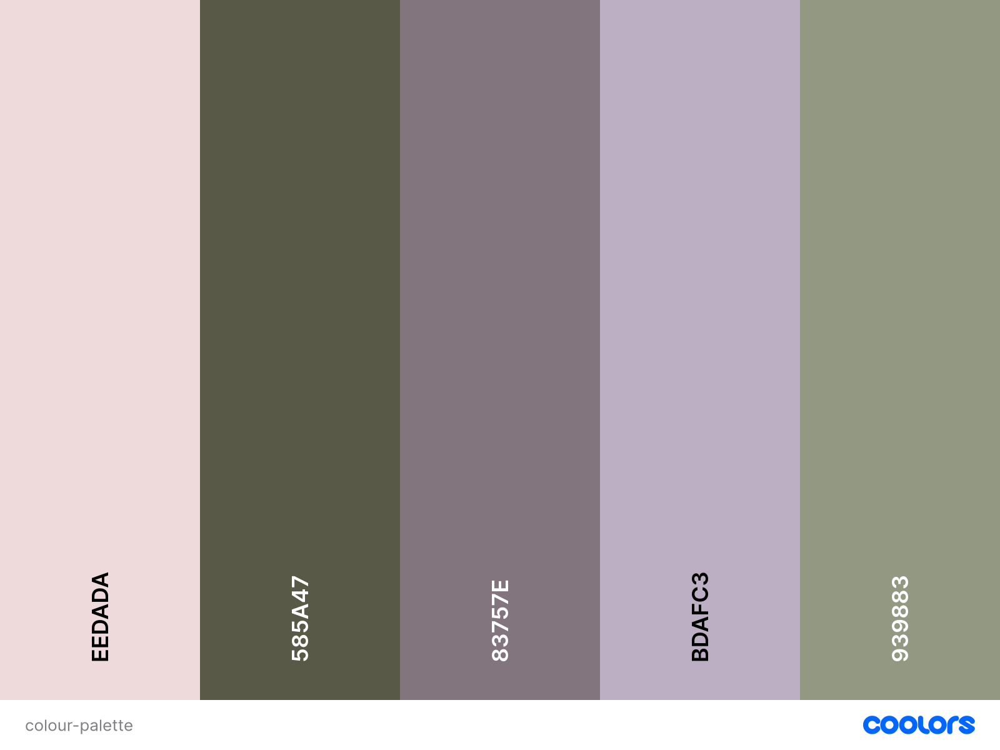
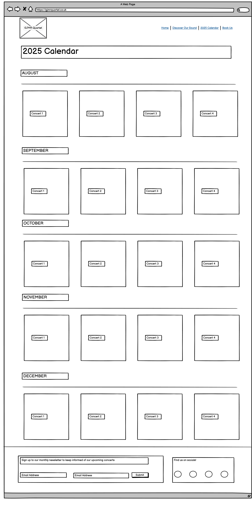
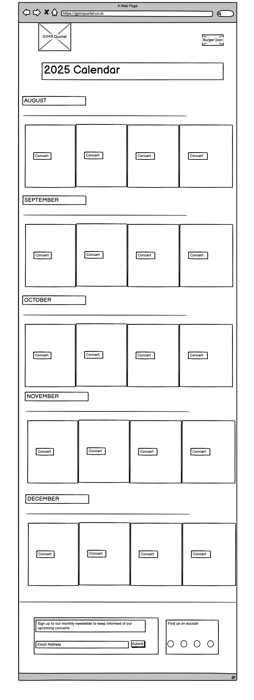
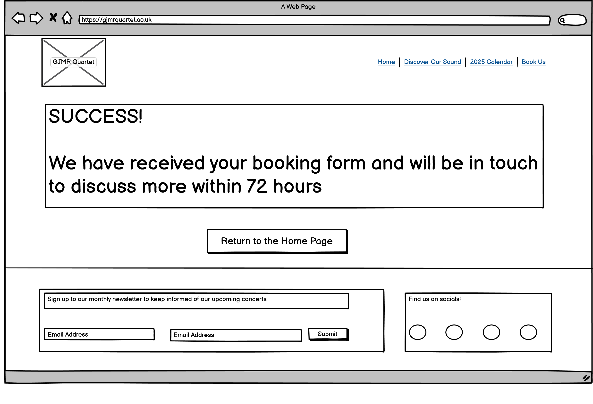
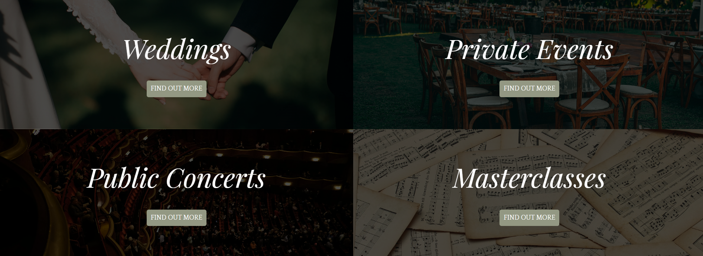
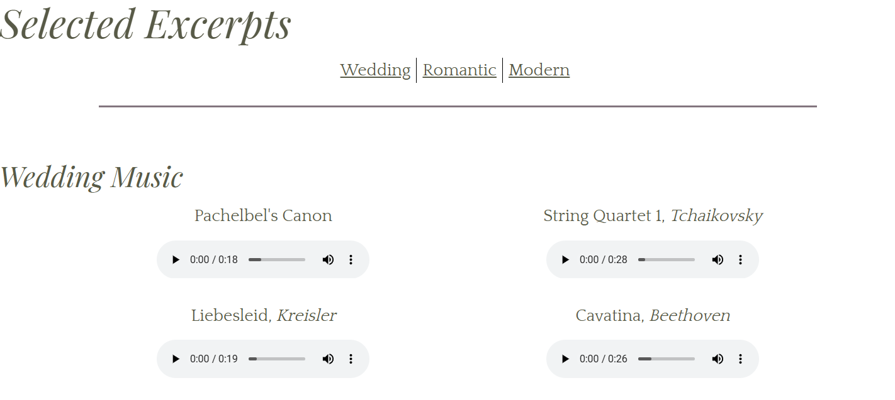
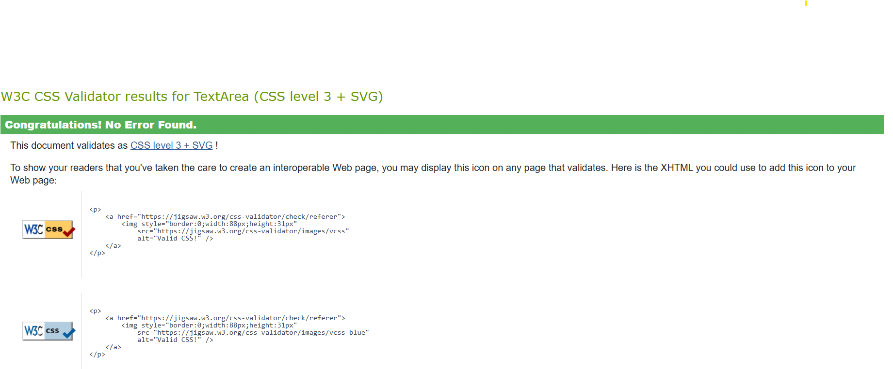

# GJMR Quartet
Image to go here

GJMR Quartet is a fictional classical string quartet that plays around the world in a variety of styles. They have expertise in performaing for weddings, high-profile public performances, intimate private evetns, and delivering top=class maserclasses to up-and-coming quartets

The mian purpose of this site is to increase bookings for weddings, private evetns and masterclassess for both people who had heard of the quartet before and new listeners to the quartet. An important function of the website therefore is to showcase why someone should be booking us, which has been achieved through both audio performances of the quartet playing and a quick overview of the recent big public prformances given, which shows the high level they are able to produce.

Visit the deployed website [here](https://greggy1234.github.io/GJMR-Quartet/)

## Table of Contents

1. [UX & Design](#ux--design)
    1. [Website Objectives](#website-objectives)
    2. [User Stories](#user-stories)
    3. [Typography](#typography)
    4. [Colour Scheme](#colour-scheme)
    5. [Wireframes](#wireframes)
2. [Features](#features)
    1. [General](#general)
    2. [Home Page](#home-page)
    3. [Discover Our Sound Page](#treatments-page)
    4. [Calendar Page](#calendar-page)
    5. [Book Now Page](#book-now-page)
    6. [Success Page](#success-page)
    7. [Future Features & Pages](#future=features-pages)
3. [Technologies Used](#technologies)
    1. [Languages](#languages)
    2. [Framewworks & Libraries](#frameworks-libraries)
    3. [Other Programs](#other-programs)
4. [Testing](#testing)
    1. [Code Validation](#code-validation)
    2. [User Story Testing](#user-story-testing)
    3. [Feature Testing](#feature-testing)
    4. [Accessibility Testing](#accesibility-testing)
    5. [Responsiveness Testing](#responsiveness-testing)
    6. [Browser & Device Testing](#browser-device-testing)
    7. [Lighthouse Testing](#lighthouse-testing)
5. [Final Website](#final-website)
6. [Deployment](#deployment)
7. [Credits](#credits)
    1. [Content](#content)
    2. [Media](#media)
    3. [Code](#code)
8. [Acknowledgements](#acknowledgements)

***

## UX & Design

### Website Objectives

* Portray the feeling of a classical music site in both colour scheme and typography. The style is traditional and relaxing

* Clearly present the services we offer - playing for weddings and private events and devliering masterclasses

* Clearly show the public concerts we will be playing in the future

* Easily allow users to book our services

* Allow users to listen to our performances

### User Stories
The aim of this site is to target 4 individual types of users all looking to interact with the GJMR Quartet. Below are the 4 types of users and their user stories.
1. Users looking to hire a string quartet for their wedding
- I want to see this quartet performs at weddings so I can book them
- I want to hear their sound so I can see if they would be relevant for my wedding
- I want to see reviews of people who have hired this quartet for their wedding
- I want an easy way to book my interest in them performing at my wedding

2. Users looking to hire a string quartet for my private function
- I want to see this quartet is available to hire for my private function
- I want to hear a selection of their repetoire to see if they would be relevant for my private function
- I want to see any recent highlight concerts to understand if they are professional enough for my private function
- I want to see reviews of people who hired them for their private function to show their professionalism
- I want an easy way to book my interest

3. Users looking for more information on the public concerts this quartet perform
- I want to hear their repetoire to see if I want to spend money on seeing them in a concert hall
- I want to know their upcoming concerts so I can review if I have availability to see them in my country
- I want to see reviews to see if the concerts are worth seeing live

4. Users looking for a masterclass
- I want to see their most recent and upcoming concerts to see if they are at a level where a masterclass would be worth spending money for
- I want to hear their sound to know if I agree with their musical stylings
- I want an easy way to book my interest

### Typography
The header font used for this website is Playfair Display with font style of Italics being added to it thoughout the site. This helps contribute to the elegance and traditional feel of the website.

The paragrpagh font used is Quattrocento, again adding to the traditional feel of the website while still being an easily readable font. 

The fallback generic-family font for both of these is Serif to continue the traditional feel even if the preferred fonts don't load correctly.

### Colour Scheme

The main background colour used is the light pink (#EEDADA). A gradient was added on each page to white at the top adn from white to light pink at the bottom. This added to the elegant feel of the website.

The primary font colour used is the dark green (#585A47) which contrasts wel with the light pink and the white background while keeping wiht the traditional feel.

The three highlight colours are the dark purple/grey (#83757E) acting as a dark highlight, the lilac (#BDAFC3) and the light green (#939883) acting as the light highlits. The dark highlight was used as the background to the Nav bar to ensure it clearly stands out throughout the website and also the border and divider colours, and all 3 highlights are used for throughout for hover effects.

### Wireframes
[Balsamiq](https://balsamiq.com/) was the app used to create the wireframes. These were create before production of the website began so there are some changes between the wireframes and the final product, including a newsletter sign up form in the footer, more audio files on the Discover Our Sound page, and a constnatly scrolling review section.

Page | Desktop Version | Tablet Version | Mobile Version
--- | --- | --- | ---
Index |  |  | 
Discover Our Sound |  |  | 
Calendar |  |  | 
Booking |  |  | 
Success |  |  | 

[Back to top ⇧](#gjmr-quartet)

## Features

### General

* Responsive design is applied throughout the website so all the information is displayed correctly no matter the screen size or device type

* The colour scheme and typography remains consistent across all pages so the webste feels unified

* **Buttons**

    - This button style is the only button style used so users know easily that it is a clickable button

    - The buttons have a hover effect to ensure users know when something can be clicked on

* **Header**

    
    - Two headers are used in this site. The header with a carousel of images are on pages where people will be spending more time so a more complex header makes the pages more involved. 
    
    - The simple header with just the logo and title of the page represent simpler pages at the end of a user's journey

    - The logo in the header acts as alink back to the Home Page

    - The Nav Bar is consistent and sticky across all pages, and the links light up on hover to allow users to know where they are clicking, including on the dropdown for the Discover Our Sound Page.

* **Footer**

    - The footer is kept simple with only some get in touch links and the quartet#s social pages, encompassed in an elegant border. This ensures the bottom of the page is not too busy while still providing some extra information.

### Home Page

* **Services Section**

    - This portrays the four services we offer in a clear manner and when the Lern More button is clicked on, a modal appears with more info. The modal allows for an easy change of information in teh future as well.

* **Reviews Section**

    - Shows glowing reviews of people who recommend the quartet to influence people's decision to choose them

* **Recent Landmark Concerts Section**

    - A quick review of large scale concerts recently given, giving the quartet a professional feel 

### Discover Our Sound Page

* This allows users to listen to varying pieces within the quartets main styles to influence their decision to choose the quaret

### Calendar Page

* A clear way for users who follow the quartet to see where they are playing next and what genre of music will be played. This centralises information and keeps users coming back to the site as they know the information they need will be there

### Book Now Page

* This form allows users to book the services they want straight from the website in a clear and easy way

* A table to inform users on what the prices for the requested service could be, keeping their expectations in check

### Success Page

* A clear message to inform the user that their details have been submitted

### Future Features & Pages
There are number of features in the future that can add to this website to improve the utility. These include:

1. A link to sign up to the newsletter containing news about the quartet and more behind the scenes commentary, which helps build relationships

2. Links to book tickets on the venue website on the calnedar page to improve the user journey

3. A media/news/PR page where mentions of the quartet can be displayed. External links is also good for SEO so that would be an added benefit

4. More media (both audio and imgages) to promote the quartet

5. A gallery page with the increased images

[Back to top ⇧](#gjmr-quartet)

## Technologies Used

### Languages

* HTML
* CSS

### Frameworks & Libraries

* [Google Fonts](https://fonts.google.com/)
    - Google Fonts was used to import the fonts Quattrocento & Playfair Display which were used as for the site's typography.

* [Font Awesome](https://fontawesome.com/)
     - Font Awesome loaded on all pages for icon use, which can be seen in the footer on every page and the review section on the home page

* [Bootstrap](https://getbootstrap.com/)
     - The Bootstrap toolkip was used throughout to ensure consistent responsive design and allow for ease styling on different devices

### Other Programs

* [Visual Studio Code](https://code.visualstudio.com/)
    - This was used to write the code of the website.

* [TinyPNG](https://tinypng.com/)
    - Files were compressed sing this site to ensure the lowest possible file size while still ensuring quality which helps keep the website running faster.

* [Cloud Convert](https://cloudconvert.com/)
    - This was used to turn files to the WEBP format.

* [GitHub](https://github.com/)
     - GitHub was used to house the code and deploy the website.

* [Balsamiq](https://balsamiq.com/)
     - Wireframes created at the beginning of the project were designed on Balsamiq.

* [Coolors](https://coolors.co/)
     - This was used to create the colour palette for the website.

* [Chrome DevTools](https://developer.chrome.com/docs/devtools/)
    - Throughout the building of the website, Chrome DevTools was used to solve any problems I had with my HTML or CSS

* [W3C Markup Validator](https://validator.w3.org/)
    - To test the HTML code, this was used.

* [W3C CSS Validator](https://jigsaw.w3.org/css-validator/)
    - To test the CSS code, this was used.
   
[Back to top ⇧](#gjmr-quartet)

## Testing

### Code Validation

* **CSS**

   - CSS has been checked and no errors were found

   - Warnings were brought up, but these are not errors in the code

* **HTML**

### User Story Testing

### Feature Testing

### Accesibility Testing

### Responsiveness Testing

### Browser & Device Testing

### Lighthouse Testing

[Back to top ⇧](#gjmr-quartet)

## Final Website

[Back to top ⇧](#gjmr-quartet)

## Deployment REDO LINKS
This project was developed using the VisualStudio Code IDE, commited to git and pushed to GitHub using the in-built function within the IDE

To deploy this page to GitHub Pages from it's [GitHub Repository](https://github.com/Greggy1234/GJMR-Quartet), the following steps were taken:
1. Log into GitHub
2. From the list of repositories, select **GJMR-Quartet**
3. Open settings from the menu options available
4. Select **Page** under the **Code and automation** option on the right side menu
5. Select **Master Branch**, after which the site is automatically deployed
6. Find the link either within the pages section of settings, or on the **Code** section of the repository on the right side options.

### How to run this project locally
To clone this project from GitHub to make further changes:
1. Go to the the [GitHub Repository](https://github.com/Greggy1234/GJMR-Quartet)
2. Click the green **Code** button
3. Copy the HTTPS url on the dropdown
4. Open your local IDE and select Git Bash
5. Navigate to the directory you want the project to be clones in (**must be an empty folder**)
6. Type `git clone` followed by the url copied in step 3 and press enter

[Back to top ⇧](#gjmr-quartet)

## Credits

### Content

- All content was written by the developer

### Media

### Code

- On the Index page, for the Services section boxes, the code for the slightly transparent overlay on a picture was taken from [dev.co](https://dev.to/selbekk/how-to-overlay-your-background-images-59le)

- [Stack Overflow](https://stackoverflow.com/) and [W3Schools](https://www.w3schools.com/) were consulted throughout the project to check the code was correctly implemented

[Back to top ⇧](#gjmr-quartet)

## Acknowledgements

[Back to top ⇧](#gjmr-quartet)